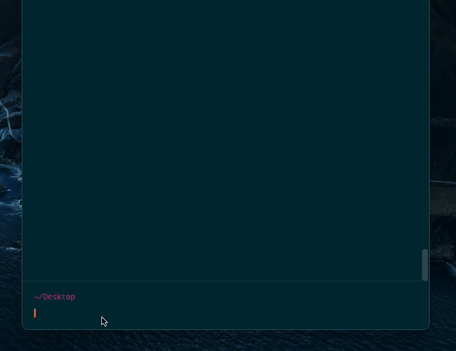

<p align="center"></p>

<p align="center">
    
    <h1 align="center">chatcli</h1>
</p>

## 介绍
<p>chatcli是一个基于openai的命令行工具，专为开发者设计，旨在提供快速、准确的代码生成和编程建议以及其他聊天<p/>
<kbd>
  
</kbd>

## 安装
<p>使用npm全局安装fuguihuahua:<p/>

```js
npm i fuguihuahua -g
```

## 使用
<p>设置OPENAI_KEY(非必要)<p/>

<p>您可以传入您自己的OPENAI_KEY或者使用默认的OPENAI_KEY(可能不稳定)<p/>

```js
huahua chat -k ${YOUR_OPENAI_KEY}
```

## 开始聊天
<p>一旦设置完成，您可以直接使用以下命令进行聊天：<p/>

```js
huahua chat
```
